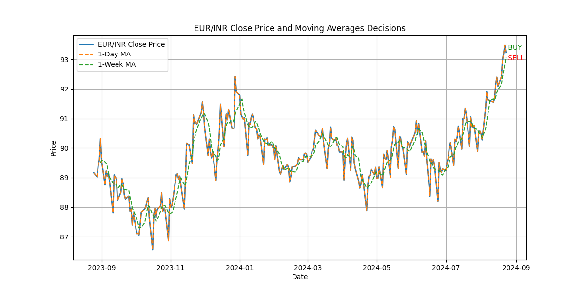
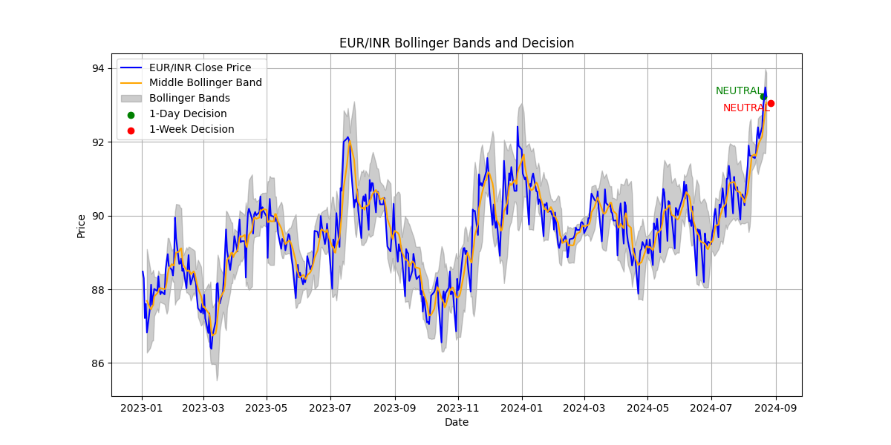
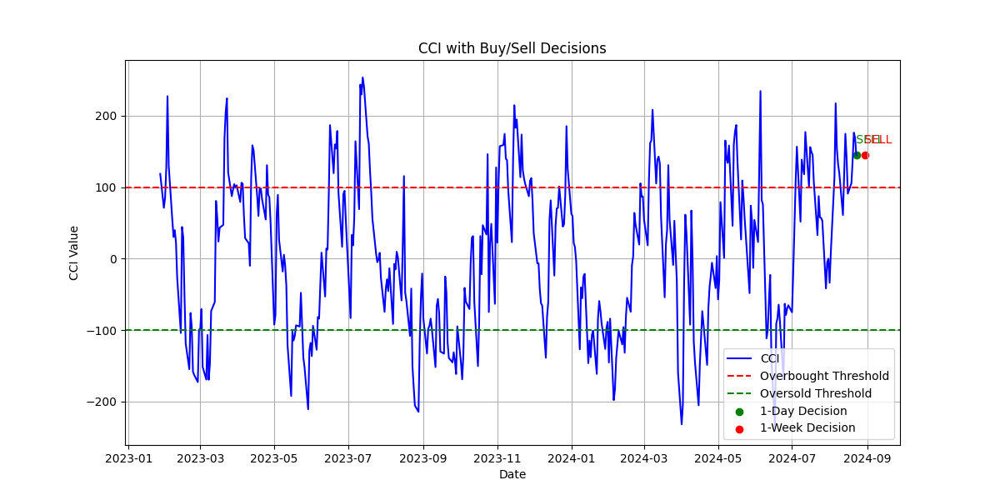

# Technical Analysis of EUR/INR Exchange Rate

Welcome to the Technical Analysis of EUR/INR Exchange Rate ! This project provides a comprehensive analysis of the EUR/INR currency pair using Moving Averages, Bollinger Bands, and Commodity Channel Index (CCI) to assist in making informed trading decisions.

## Project

### 1. EUR/INR Technical Analysis
- **Description**: This project includes Python scripts for calculating Moving Averages, Bollinger Bands, and CCI for the EUR/INR exchange rate. The analyses generate trading decisions and visualizations based on historical data.
- **Technologies Used**: Python, yFinance, pandas, matplotlib, numpy
- **Code**: [pythoncode.py](./pythoncode.py)
- **Screenshots**:
  - 
  - 
  - 
- **Presentation**: (./Presentation.pptx)

## How to Run the Code
1. **Set Up the Environment**:
   - Clone the repository:
     ```bash
     git clone https://github.com/yourusername/Technical-Analysis-of-EUR-INR-Exchange-Rate.git
     ```
   - Navigate to the project directory:
     ```bash
     cd Technical-Analysis-of-EUR-INR-Exchange-Rate
     ```
   - Create and activate a virtual environment (optional but recommended):
     ```bash
     python -m venv venv
     source venv/bin/activate  # On Windows use `venv\Scripts\activate`
     ```
   - Install the required libraries:
     ```bash
     pip install -r requirements.txt
     ```

2. **Run the Script**:
   - Execute the Python script to perform the analysis:
     ```bash
     python pythoncode.py
     ```

3. **Review the Output**:
   - The script will generate CSV files with trading decisions and save plots as images in the project directory.

## Contact
If you have any questions or need further information, feel free to reach out to me at (mailto:nilavanpoz123@gmail.com).
